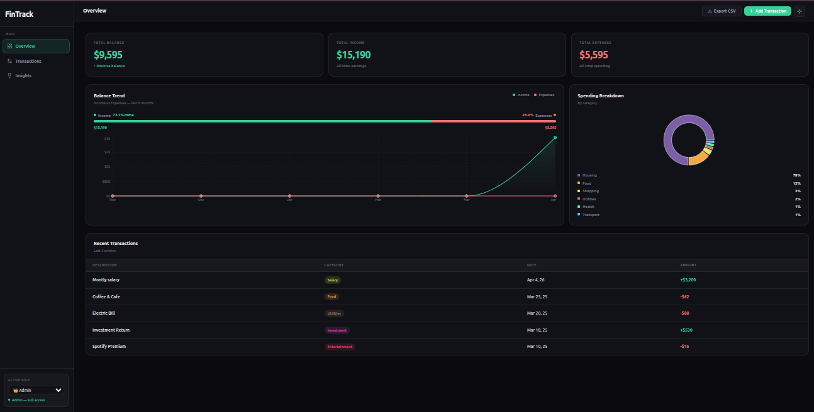
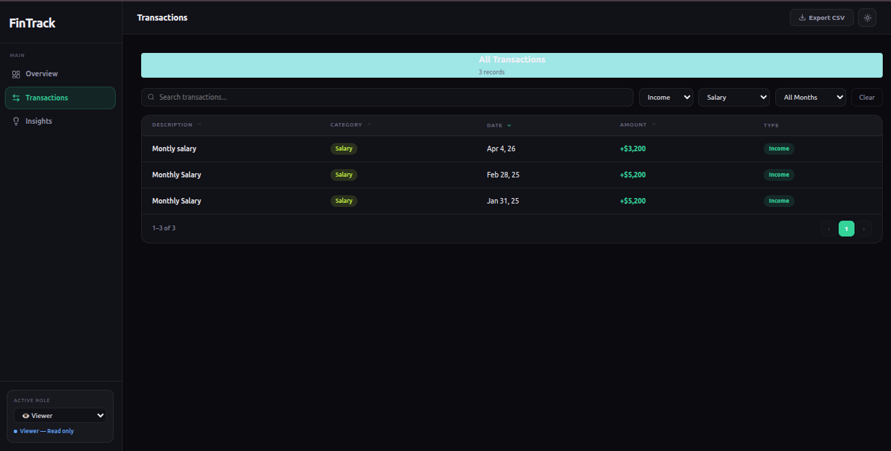
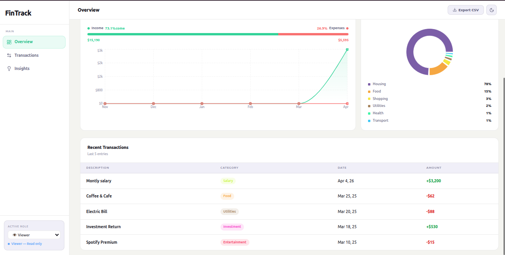
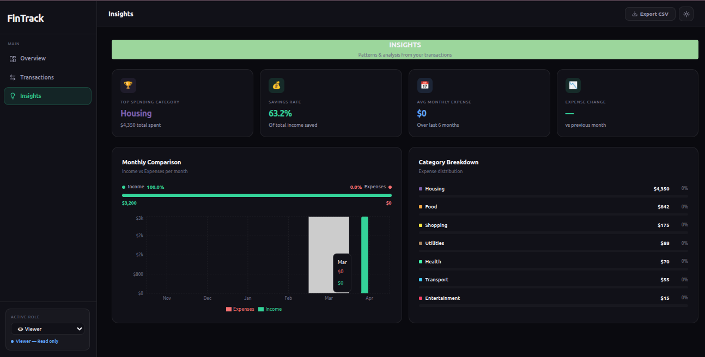

# 💰 Finio — Finance Dashboard

A clean, responsive **personal finance dashboard** built with React and TypeScript.
Finio helps users track income, monitor expenses, and gain quick insights into spending patterns through intuitive UI and visualizations.

---

## 🚀 Features

* 📊 **Dashboard Overview**

  * Summary cards for Total Balance, Income, and Expenses
  * Time-based and category-based charts

* 📋 **Transactions Management**

  * View all transactions with key details
  * Filter and search functionality
  * Sort by date or amount

* 🔐 **Role-Based UI**

  * **Viewer** → Read-only access
  * **Admin** → Add and manage transactions

* 🧠 **Insights Section**

  * Highest spending category
  * Monthly comparison
  * Smart spending observations

* 🎨 **Responsive Design**

  * Optimized for desktop and mobile devices

---

## 🛠️ Tech Stack

| Layer      | Technology                 |
| ---------- | -------------------------- |
| Framework  | React 18 + TypeScript      |
| Build Tool | Vite                       |
| Styling    | Plain CSS (CSS Variables)  |
| Charts     | Recharts                   |
| State      | Zustand (with persistence) |
| Routing    | React Router DOM v6        |
| Icons      | Lucide React               |

---

## ⚙️ Getting Started

### 📌 Prerequisites

* Node.js 18+
* npm 9+

### 📦 Installation

```bash
git clone https://github.com/your-username/finio-dashboard.git
cd finio-dashboard
npm install
npm run dev
```

---

## 📁 Project Structure

```
src/
 ├── components/
 ├── pages/
 ├── store/
 ├── data/
 ├── utils/
 └── App.tsx
```

---

## 🧠 Approach

The application is built with a focus on **modularity and scalability**:

* Zustand is used for lightweight and efficient state management
* Components are reusable and separated by responsibility
* Mock data simulates real-world financial transactions
* Role-based UI is handled at the frontend level for demonstration

---

## ✨ Optional Enhancements (Implemented / Planned)

* 🌙 Dark Mode
* 💾 Local Storage Persistence
* 🔄 Smooth UI Transitions
* 📤 Data Export (CSV/JSON)

---

## 📸 Screenshots

🔹 Dashboard (Admin - Dark Mode)
<p align="center">  </p>
🔹 Transactions (Viewer - Dark Mode)
<p align="center">  </p>
🔹 Transactions (Admin - Light Mode)
<p align="center">  </p>
🔹 Overview (Viewer - Light Mode)
<p align="center">  </p>
🔹 Insights (Viewer - Dark Mode)
<p align="center">  </p>

---

## 🌐 Live Demo

*Add your deployed link here (Vercel / Netlify)*

---

## 🤝 Contribution

Contributions, suggestions, and feedback are welcome!

---

## 📄 License

This project is for evaluation and learning purposes.
